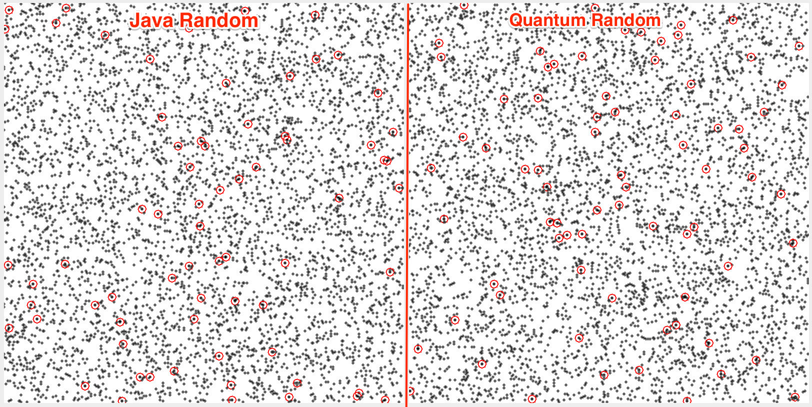

quantum-random
==============

Quantum Random
This will generate random long values based on ANU Quantum Random Number Generator data.
See http://qrng.anu.edu.au/ for more info.

Note:
  Import the SSL certificate from iqrng.anu.edu.au. 
  E.g.: In JDK 1.7.0_45:
  ```sudo keytool -import -file ~/AusCERTServerCA.crt -keystore /Library/Java/JavaVirtualMachines/jdk1.7.0_45.jdk/Contents/Home/jre/lib/security/cacerts```

Run:
```mvn exec:java -Dexec.mainClass=com.lasanthak.RandomVisualizer```


##Screen Shot

